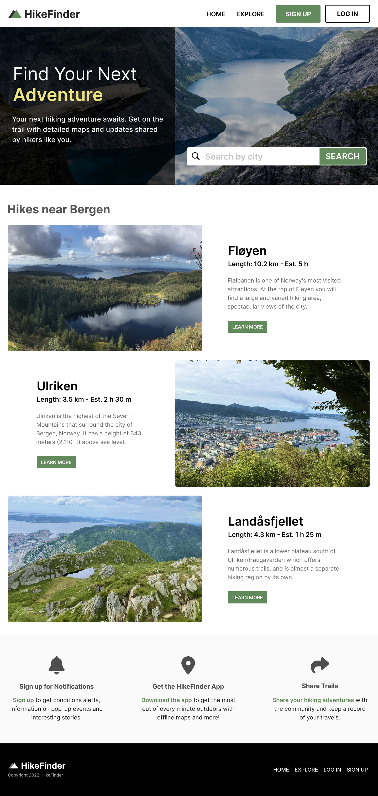

# Scrimba Bootcamp - Solo Projects

This is a solution to the [M6 - HikeFinder](https://scrimba.com/scrim/cBR2mvuW).

## Screenshot

## Links

- Live Site: [Netlify](https://luminous-sable-d5ec11.netlify.app/)
- Codebase: [Github](https://github.com/abilioassis/hikefinder)
- Code review: [Scrimba](https://scrimba.com/scrim/co68e4c4da5dbd7cbdbeb48b5)

## Built with

- Semantic HTML5 markup.
- CSS3.
- JavaScript (no frameworks).

## Author

- [Abilio Assis](https://www.linkedin.com/in/abilio-assis/)
